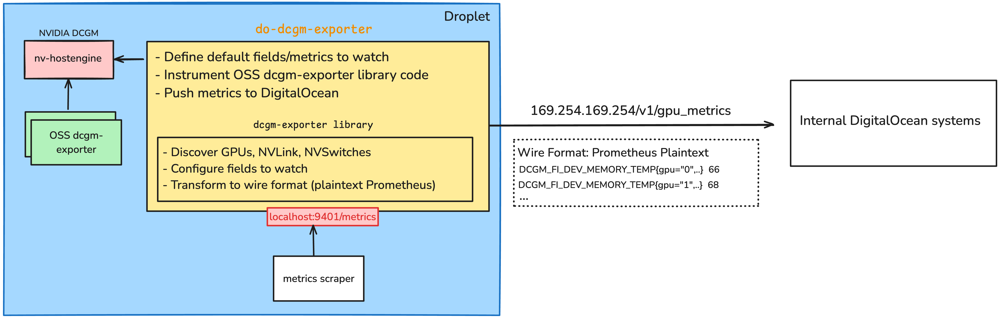

# DigitalOcean DCGM-Exporter

## Overview

The DigitalOcean DCGM-Exporter is a thin wrapper around the [DCGM-Exporter](https://github.com/NVIDIA/dcgm-exporter).

The following functionality is added
- configuration of a default set of [DCGM fields](https://docs.nvidia.com/datacenter/dcgm/latest/dcgm-api/dcgm-api-field-ids.html) to be monitored. Additional fields can be configured using the `--collectors` flag (like with dcgm-exporter).
- forwarding of the collected metrics to the in-droplet accessible DigitalOcean endpoint with static ip `169.254.169.254`.
- requirement of a standalone DCGM installation with `nv-hostengine` serving on `localhost:5555`. This is to avoid conflicts with existing `dcgm-exporter` installations.

Exposes a `/metrics` endpoint serving the collected Prometheus metrics on port `9401`.

# Run Requirements

Requires [DCGM](https://developer.nvidia.com/dcgm) and [NVIDIA drivers](https://docs.nvidia.com/datacenter/tesla/driver-installation-guide/index.html) to be installed.

# Installation

TODO: publish package

To build the DigitalOcean DCGM export manually, please see [here](docs/build.md)

# Conflict with existing DCGM installation

Please note that there can only be one DCGM installation on a host. This includes an `embedded` DCGM process started by the NVIDIA [dcgm-exporter](https://github.com/NVIDIA/dcgm-exporter).

Hence, to run the DigitalOcean dcgm-exporter next to the NVIDIA [dcgm-exporter](https://github.com/NVIDIA/dcgm-exporter),
- please create a [standalone installation of DCGM](https://docs.digitalocean.com/products/droplets/how-to/gpu/enable-metrics/#install-dcgm).
- configure the NVIDIA [dcgm-exporter](https://github.com/NVIDIA/dcgm-exporter) to connect to the remote `nv-hostengine` serving on `localhost:5555` (via flag `-r localhost:5555`).

The DigitalOcean DCGM exporter connects to a `nv-hostengine` process serving on `localhost:5555`.

# Testing Restrictions

The DigitalOcean DCGM exporter is a thin wrapper around the DCGM-Exporter.
While this has the benefit of being able to reuse functionality, it restricts the DigitalOcean DCGM-Exporter to the boundaries setup by the DCGM-Exporter code.
Specifically, variables required for [mocking hardware (GPUs, NVSwitches, ...) are not exported](https://github.com/NVIDIA/dcgm-exporter/blob/rel_3.3.6-3.4.2/pkg/dcgmexporter/system_info.go#L31).

As a result, this project does not contain test cases covering `dcgm-exporter` functionality that requires real hardware. 